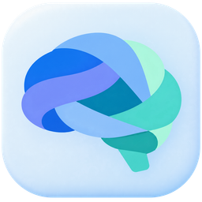

# Brain for Windows

Record the conversation. Keep the useful details.

Brain brings your meetings, notes, and next steps together on your Windows PC.
See the actual app, including its meeting assistant, on the
[Brain website](https://samishariff.github.io/Brain-Windows-Releases/).

**Brain for Mac is available now** — download it from the
[Mac page](https://samishariff.github.io/Brain-Windows-Releases/mac.html)
(macOS 26 or later, Apple silicon). The Mac app is hosted in this repository's
Releases as a signed, notarized disk image, and the installed app checks this
repository's `mac-v<version>` releases to update itself.

**Downloads for the Windows preview are being prepared.** This repository does
not yet offer a Windows installer or an automatic-update feed.

- [Getting started](https://samishariff.github.io/Brain-Windows-Releases/help/)
- [Your privacy](https://samishariff.github.io/Brain-Windows-Releases/privacy/)
- [What is included and still being checked](https://samishariff.github.io/Brain-Windows-Releases/release-notes.html)

The screenshots show the real Windows preview with fictional meeting content.
Speech and summary tools can run on your PC; optional online services are your
choice. Google and Microsoft calendar sign-in is still being prepared.

This public repository holds the website, approved images, public release
information, and third-party notices. Brain's application source and signing
keys stay private. When downloads are ready, the installers will be hosted in
this repository's Releases, and this website will provide the update feed.

If Sami has already shared an earlier preview with you, keep your existing copy
and backups. Installation, installed updates, and real recording devices still
need testing. For help, contact Sami through your usual private channel.

Keep recordings, meeting text, account details, passwords, and diagnostic reports
out of public posts.

Third-party software notices are in [THIRD_PARTY_NOTICES.md](THIRD_PARTY_NOTICES.md).
The website's Manrope font is distributed with its [open-font licence](assets/Manrope-OFL.txt).
